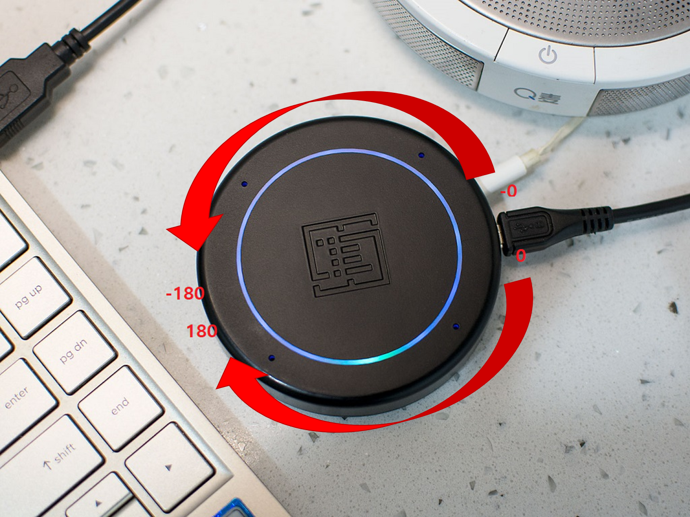

respeaker_ros
=============

A ROS Package for Respeaker Mic Array


## Supported Devices

- [Respeaker Mic Array v2.0](http://wiki.seeedstudio.com/ReSpeaker_Mic_Array_v2.0/)

    

## Preparation

1. Install reaspeaker
    
    Update Firmware
    ```bash
    $ sudo apt-get update
    $ sudo apt-get install python-usb
    $ sudo pip install pyusb click
    $ cd ~
    $ git clone https://github.com/jstar0525/usb_4_mic_array.git
    $ cd usb_4_mic_array
    $ sudo python dfu.py --download 6_channels_firmware.bin  # The 6 channels version 

    # if you want to use 1 channel,then the command should be like:
    $ sudo python dfu.py --download 1_channel_firmware.bin
    ```

    Tuning
    ```bash
    $ cd ~/usb_4_mic_array
    $ python tuning.py -p
    ```

    DOA (Direction of Arrival)
    ```bash
    $ cd ~/usb_4_mic_array
    $ sudo python doa.py 
    ```

    Extract Voice
    ```bash
    $ sudo apt-get install portaudio19-dev python-pyaudio
    $ sudo pip install pyaudio
    $ cd ~/usb_4_mic_array
    $ python get_idx.py
    ```

    ref : https://jstar0525.tistory.com/103

1. Install this package

    ```bash
    $ mkdir -p ~/catkin_ws/src && cd ~/catkin_ws/src
    $ git clone https://github.com/jstar0525/respeaker_ros.git
    ```

1. Install python requirements

    ```bash
    $ cd ~/catkin_ws/src/respeaker_ros
    $ sudo pip install -r requirements.txt
    ```

1. Build this package from source

    ```bash
    $ cd ~/catkin_ws
    $ source /opt/ros/melodic/setup.bash
    $ rosdep install --from-paths src -i -r -n -y
    $ sudo apt-get install ros-melodic-catkin-virtualenv
    $ catkin_make
    $ source ~/catkin_ws/devel/setup.bash
    ```

1. Register respeaker udev rules

    Normally, we cannot access USB device without permission from user space.
    Using `udev`, we can give the right permission on only respeaker device automatically.

    Please run the command as followings to install setting file:

    ```bash
    $ roscd respeaker_ros
    $ sudo cp -f $(rospack find respeaker_ros)/config/60-respeaker.rules /etc/udev/rules.d/60-respeaker.rules
    $ sudo systemctl restart udev
    ```

    And then re-connect the device.

1. Update firmware

    ```bash
    $ git clone https://github.com/respeaker/usb_4_mic_array.git
    $ cd ~/usb_4_mic_array
    $ sudo python dfu.py --download 6_channels_firmware.bin  # The 6 channels version 
    ```

## How to use

1. Run executables
    ```bash
    $ source /opt/ros/melodic/setup.bash
    $ source ~/catkin_ws/devel/setup.bash
    $ roscore
    ```
    ```bash
    $ source /opt/ros/melodic/setup.bash
    $ source /home/user/catkin_ws/devel/setup.bash
    $ rosrun respeaker_ros respeaker_node.py
    ```
    ```bash
    # Check Ros topic
    $ source /opt/ros/melodic/setup.bash
    $ source ~/catkin_ws/devel/setup.bash
    $ rostopic echo /sound_direction     # Result of DoA
    $ rostopic echo /sound_localization  # Result of DoA as Pose
    $ rostopic echo /is_speeching        # Result of VAD
    $ rostopic echo /audio               # Raw audio
    ```

    

    You can also set various parameters via `dynamic_reconfigure`.

    ```bash
    $ sudo apt install ros-melodic-rqt-reconfigure  # Install if not
    $ rosrun rqt_reconfigure rqt_reconfigure
    ```

    To set LED color, publish desired color:

    ```bash
    $ rostopic pub /status_led std_msgs/ColorRGBA "r: 0.0
    g: 0.0
    b: 1.0
    a: 0.3"
    ```


## Notes

The configuration file for `dynamic_reconfigure` in this package is created automatically by reading the parameters from devices.
Though it will be rare case, the configuration file can be updated as followings:

1. Connect the device to the computer.
1. Run the generator script.

    ```bash
    $ rosrun  respeaker_ros respeaker_gencfg.py
    ```
1. You will see the updated configuration file at `$(rospack find respeaker_ros)/cfg/Respeaker.cfg`.


## Author

Yuki Furuta <<furushchev@jsk.imi.i.u-tokyo.ac.jp>>

## License

[Apache License](LICENSE)
